# Amplified Futures

Twelve VCV Rack 2 modules for dense experimental sound. Massed oscillators, controlled feedback, no-wave rhythmics, microtonal pressure. No-wave/noise-rock genealogy; built for live performance.

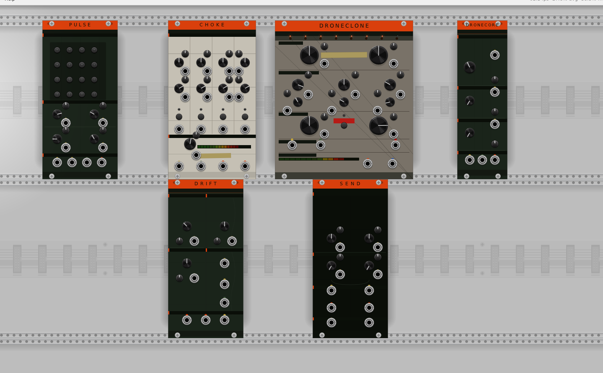

---

## Modules

---

### DRONECORE — 8HP

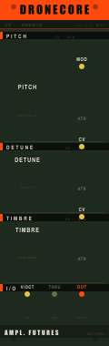

Two-voice detuned oscillator core. PITCH, DETUNE (0–100¢ spread), TIMBRE (sine to third-bridge harmonic stack). Fully polyphonic. Every knob has CV + attenuverter. V/OCT pass-through.

**Inputs:** V/OCT, PITCH CV + ATT, DETUNE CV + ATT, TIMBRE CV + ATT
**Outputs:** OUT (poly audio), THRU (V/OCT pass-through)

---

### DRONECLONE — 22HP

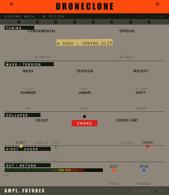

8-voice amplified string wall. MASS (active voice count), TENSION (harmonic edge), SHIMMER (air), JAWARI (rattle/buzz), WEIGHT (sub body), DRIFT (per-voice wander). CHOKE button/gate collapses the wall. RTN feedback input for self-patching loops. Polyphonic — up to 16 poly channels × 8 voices = 128 simultaneous oscillators.

**Inputs:** V/OCT (poly), RTN (feedback return), CHOKE gate, CV + ATT per knob
**Outputs:** OUT L/R (stereo audio), THRU (V/OCT pass-through)

---

### SEND — 12HP

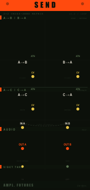

2×2 cross-send feedback routing matrix. A→B send, B→A return, A→C/C→A internal feedback bus. One-sample delayed C-bus for safe self-oscillation without instability. Polyphonic.

**Inputs:** A IN, B IN, C IN (feedback bus), SEND CV + ATT per path
**Outputs:** A OUT, B OUT, C OUT

---

### CHOKE — 14HP

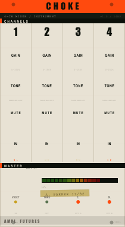

4-channel mixer built as an instrument. GAIN + TONE per channel. Fixed auto-pan spread (L / L–C / R–C / R). MUTE buttons per channel. MAIN master with soft saturation. Stereo L/R out.

**Inputs:** CH 1–4 audio, GAIN CV + ATT per channel, MUTE gates
**Outputs:** MAIN L, MAIN R

---

### PULSE — 12HP

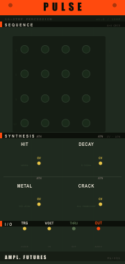

16-step no-wave step percussion. 4×4 toggle grid. White noise synthesis per step: HIT level, DECAY time (8–500 ms), METAL (LP filter 360→80 Hz), CRACK (4 ms transient burst). TRG clock in, audio out.

**Inputs:** TRG (clock/trigger), HIT CV, DECAY CV, METAL CV, CRACK CV
**Outputs:** OUT (audio)

---

### DRIFT — 12HP

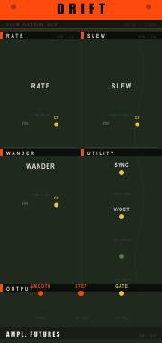

Slow random modulation source. RATE (0.01–10 Hz exponential), WANDER (random walk step size), SLEW (1000→0.1 Hz LP). SYNC input forces an immediate step. Three simultaneous outputs: SMOOTH (slewed ±5V), STEP (raw ±5V), GATE (10V 5ms pulse on each step). V/OCT pass-through.

**Inputs:** SYNC, RATE CV + ATT, WANDER CV + ATT, SLEW CV + ATT
**Outputs:** SMOOTH, STEP, GATE, THRU (V/OCT)

---

### WALL CONDUCTOR — 22HP

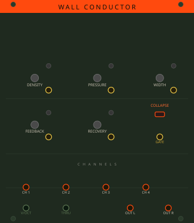

Section-based performance mixer/conductor. DENSITY sweeps 4 channels in. PRESSURE saturates. WIDTH spreads stereo field. FEEDBACK loop (1-sample safe). COLLAPSE gate with shaped RECOVERY. Master stereo out.

**Inputs:** CH 1–4 audio, COLLAPSE gate, CV + ATT per knob
**Outputs:** OUT L, OUT R

---

### STRING MASS CORE — 16HP

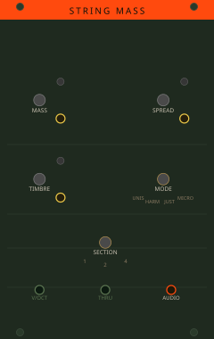

16-voice harmonic mass oscillator. MASS (voice count), SPREAD (detune), TIMBRE (harmonic content). Four modes: UNIS (unison), HARM (odd-harmonic sections), JUST (Ptolemaic JI ratios), MICRO (spectral microtonality). 1/√N amplitude normalised. Polyphonic V/OCT in → audio out.

**Inputs:** V/OCT (poly), MASS CV + ATT, SPREAD CV + ATT, TIMBRE CV + ATT
**Outputs:** OUT (poly audio)

---

### HARMONIC PRESSURE — 14HP

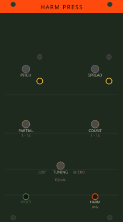

Harmonic series pitch CV generator. PITCH root + SPREAD ensemble detuning. PARTIAL selects first partial, COUNT sets how many (polyphonic channels). JUST / EQUAL / MICRO tuning modes. Outputs polyphonic V/OCT — pair directly with String Mass Core.

**Inputs:** V/OCT root, PITCH CV + ATT, SPREAD CV + ATT, PARTIAL CV, COUNT CV
**Outputs:** OUT (poly V/OCT), THRU (V/OCT pass-through)

---

### COLLAPSE SATURATOR — 12HP

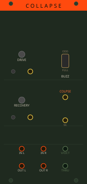

Stereo drive/saturation with collapse. DRIVE pre-gain. BUZZ character: ODD (symmetric tanh), EVEN (asymmetric tape DC-free), FULL (hard clip). COLLAPSE gate instantly maxes drive; RECOVERY sets return time. Sidechain input boosts drive. V/OCT pass-through.

**Inputs:** IN L, IN R, SIDECHAIN, COLLAPSE gate, DRIVE CV + ATT
**Outputs:** OUT L, OUT R, THRU (V/OCT)

---

### FEEDBACK GOVERNOR — 12HP

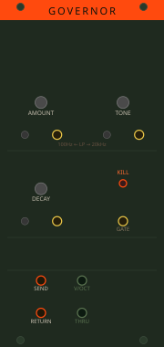

Controlled feedback send/return. AMOUNT level. TONE LP filter (100Hz → 20kHz). DECAY attenuates per feedback pass (`amount × 0.5^(4×decay)`). KILL button/gate zeros the feedback path immediately. DC blocker + ±10V safety limiter on the return. V/OCT pass-through.

**Inputs:** SND (send in), RTN (return in), KILL gate, AMOUNT CV + ATT, TONE CV + ATT, DECAY CV + ATT
**Outputs:** SND OUT, RTN OUT, THRU (V/OCT)

---

### MASS DRIVER — 32HP (AF-01)

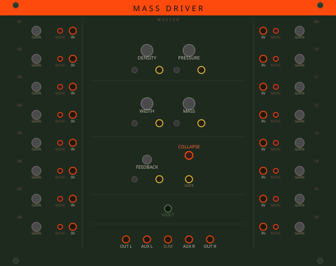

16-channel no-wave mixer: the centrepiece. DENSITY sweep brings channels in progressively. PRESSURE saturates the sum. WIDTH spreads the stereo field. FEEDBACK send/return with per-step attenuation. COLLAPSE gate with shaped RECOVERY. Channels laid out in two banks of 8; GAIN, MUTE, and pan per channel. Stereo L/R + AUX L/R out.

**Inputs:** CH 1–16 audio, COLLAPSE gate, DENSITY/PRESSURE/WIDTH/FEEDBACK/MASS CV + ATT
**Outputs:** OUT L, OUT R, AUX L, AUX R, SUM (mono)

---

## Design system

All modules share:
- **CV + attenuverter** on every knob (trimpot + jack adjacent to each control)
- **V/OCT pass-through** on every module — chain freely
- **Amplified Futures palette** — safety orange header (`#FF4A0E`), dark steel body (`#1F2A1F`), signal yellow CV jacks, thru-green V/OCT jacks, ember audio jacks
- **Module name** drawn via C++ NanoVG (not SVG text) for font-independent rendering

---

## Building from source

Requires [VCV Rack 2 SDK](https://vcvrack.com/downloads/) and [MSYS2](https://www.msys2.org/) with the MinGW64 toolchain (Windows), or the equivalent GCC toolchain on macOS/Linux.

Download the Rack SDK for your platform and set `RACK_DIR` to its path:

```bash
RACK_DIR=/path/to/Rack-SDK make -j4
```

The CI workflow (`.github/workflows/build.yml`) shows the full Windows/MSYS2 setup if you need a reference.

## Installing locally

Copy the built plugin folder into your Rack 2 user plugins directory:

| Platform | Path |
|---|---|
| Windows | `%LOCALAPPDATA%\Rack2\plugins-win-x64\` |
| macOS | `~/Library/Application Support/Rack2/plugins/` |
| Linux | `~/.Rack2/plugins/` |

---

*Daniel Boles / Amplified Futures — 2026*
